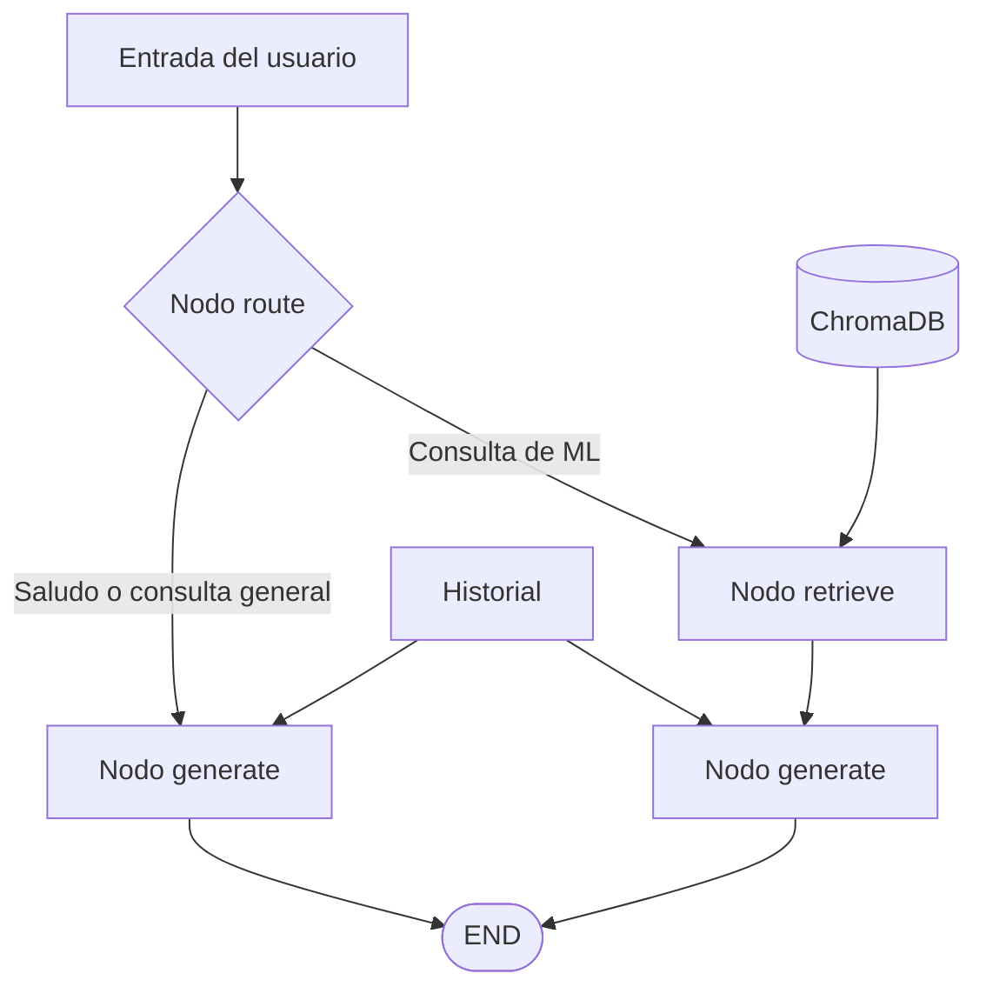

<div align="center">

# Agente experto en Machine Learning

### RAG con Scikit-Learn, TensorFlow, Gemini y LangGraph

Asistente de inteligencia artificial que responde preguntas basándose en el libro  
***Machine Learning with Scikit-Learn and TensorFlow***.

`Python 3.10+` · `Google Gemini` · `LangGraph` · `ChromaDB` · `Jupyter Notebook`

</div>

---

## Contenido

- [Descripción](#descripción)
- [Dominio de conocimiento](#dominio-de-conocimiento)
- [Características](#características)
- [Tecnologías](#tecnologías)
- [Requisitos](#requisitos)
- [Instalación y ejecución](#instalación-y-ejecución)
- [Arquitectura](#arquitectura)
- [System Prompt](#system-prompt)
- [Enrutamiento y memoria](#enrutamiento-y-memoria)

---

## Descripción

Este proyecto implementa un agente basado en **RAG** (*Retrieval-Augmented Generation*) que recupera información relevante de un libro de Machine Learning y genera respuestas fundamentadas en ese contenido.

El agente utiliza:

- **Google Gemini** como modelo de lenguaje y proveedor de embeddings.
- **ChromaDB** para almacenar y consultar el conocimiento vectorizado.
- **LangGraph** para controlar el flujo, el enrutamiento y la memoria conversacional.
- **LangChain** para procesar y dividir el contenido del PDF.

> [!IMPORTANT]
> Las respuestas sobre Machine Learning se generan a partir del contexto recuperado del libro, reduciendo al mínimo las alucinaciones.

---

## Dominio de conocimiento

El libro cubre los principales fundamentos y herramientas de Machine Learning en Python:

| Área | Contenido |
| :--- | :--- |
| **Fundamentos** | Aprendizaje supervisado, no supervisado y evaluación de modelos |
| **Algoritmos** | Regresión, SVM, árboles de decisión, Random Forest y Gradient Boosting |
| **Scikit-Learn** | Pipelines, transformadores, validación cruzada y búsqueda de hiperparámetros |
| **Redes neuronales** | Perceptrón, backpropagation, redes densas y convolucionales |
| **TensorFlow / Keras** | Construcción, compilación, entrenamiento y despliegue de modelos |
| **Técnicas avanzadas** | Regularización, dropout, batch normalization y transfer learning |

---

## Características

- Respuestas fundamentadas en el contenido del PDF.
- Búsqueda semántica mediante embeddings.
- Persistencia local de la base vectorial.
- Enrutamiento automático entre consultas RAG y respuestas directas.
- Memoria del historial de conversación.
- Respuestas didácticas con ejemplos de código cuando son útiles.
- Chat interactivo desde Jupyter Notebook.

---

## Tecnologías

| Componente | Tecnología |
| :--- | :--- |
| **LLM** | Google Gemini `gemini-2.5-flash-lite` |
| **Embeddings** | Google Gemini `gemini-embedding-001` |
| **Base vectorial** | ChromaDB, persistida en `./chroma_ml_book/` |
| **Extracción del PDF** | pypdf |
| **División de texto** | LangChain `RecursiveCharacterTextSplitter` |
| **Agente** | LangGraph + LangChain |
| **Entorno** | Jupyter Notebook con Python 3.10+ |

---

## Requisitos

### Dependencias de Python

```text
langchain>=0.3.0
langchain-google-genai>=2.0.0
langchain-chroma>=0.1.0
langchain-text-splitters>=0.3.0
langgraph>=0.2.0
chromadb>=0.5.0
pypdf>=4.0.0
python-dotenv>=1.0.0
ipywidgets>=8.0.0
```

### API key de Gemini

Crea un archivo `.env` en la raíz del proyecto:

```env
GEMINI_API_KEY=tu_api_key_aqui
```

La API key se puede obtener desde [Google AI Studio](https://aistudio.google.com/app/apikey).

> [!CAUTION]
> No publiques el archivo `.env` ni incluyas tu API key en el repositorio.

---

## Instalación y ejecución

### 1. Instala las dependencias

```bash
pip install -r requirements.txt
```

### 2. Configura las credenciales

Comprueba que el archivo `.env` contenga la variable `GEMINI_API_KEY`.

### 3. Añade el libro

Coloca el siguiente archivo en la raíz del proyecto:

```text
Machine Learning with Scikit Learn and TensorFlow.pdf
```

### 4. Abre el notebook

```bash
jupyter notebook agente_ml_book.ipynb
```

### 5. Ejecuta las celdas en orden

| Celdas | Acción |
| :---: | :--- |
| **1** | Instala las dependencias |
| **2** | Importa y configura los componentes |
| **3** | Carga el PDF y limpia el texto |
| **4** | Divide el contenido y construye los documentos |
| **5** | Crea o carga la base vectorial |
| **6** | Verifica la base mediante consultas de prueba |
| **7–9** | Configura el LLM, el grafo y las funciones auxiliares |
| **10** | Ejecuta siete preguntas de ejemplo |
| **11** | Inicia el chat interactivo |

> [!NOTE]
> La primera indexación puede tardar varios minutos. Después, ChromaDB carga la información desde `./chroma_ml_book/` sin procesar nuevamente el PDF.

---

## Arquitectura



El estado del grafo, `AgentState`, conserva:

| Campo | Descripción |
| :--- | :--- |
| `messages` | Historial acumulado con `HumanMessage` y `AIMessage` |
| `context` | Últimos fragmentos recuperados del PDF |
| `question` | Pregunta actual del usuario |
| `route` | Decisión de enrutamiento: `RAG` o `DIRECTO` |

---

## System Prompt

El *system prompt* define al agente como un **instructor experto en Machine Learning**. Sus principales decisiones de diseño son:

1. **Rol explícito**  
   Establece el dominio y un tono didáctico al definir al asistente como un agente experto en Machine Learning con Python.

2. **Prohibición de inventar información**  
   Si el contenido recuperado no permite responder, el agente debe indicarlo en lugar de generar una respuesta plausible pero incorrecta.

3. **Limitación del dominio**  
   Mantiene la conversación enfocada en el libro y evita desviaciones hacia temas no relacionados.

4. **Enfoque didáctico**  
   Incluye ejemplos de código cuando aportan claridad, en línea con la orientación práctica del libro.

5. **Temperatura baja (`0.2`)**  
   Favorece respuestas deterministas, técnicas y basadas en el contexto disponible.

---

## Enrutamiento y memoria

### Nodo `route`

El agente clasifica cada consulta antes de responder:

| Ruta | Cuándo se utiliza | Comportamiento |
| :---: | :--- | :--- |
| **RAG** | Preguntas sobre Machine Learning, algoritmos, Scikit-Learn, TensorFlow, Keras o capítulos del libro | Recupera contexto de ChromaDB y genera una respuesta fundamentada |
| **DIRECTO** | Saludos, despedidas o preguntas sobre el asistente | Responde sin consultar el libro, reduciendo tokens y latencia |

El enrutamiento utiliza una lista de palabras clave en lugar de una llamada adicional al LLM. Esto hace que la decisión sea **rápida, determinista y económica**.

### Memoria conversacional

En cada turno se envía a Gemini el historial completo de mensajes. De esta forma, el agente mantiene la coherencia de la conversación y puede hacer referencia a respuestas anteriores.
